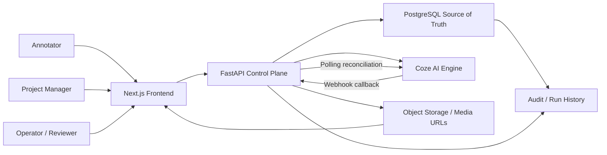

# Architecture

Status: `review-ready`  
Owner: `architect`  
Last Updated: `2026-03-19`

## Purpose

MutiData-Nexus is a unified AI data operations platform that combines:

1. Multimodal annotation for image, audio, and video assets
2. Project risk monitoring with analysis and strategy suggestions

The fixed execution policy for the product is:

- Frontend: `Next.js` + `React`
- Backend: `FastAPI`
- Database: `PostgreSQL`
- ORM: `SQLAlchemy 2.0 ORM` with `Alembic` migrations
- API style: REST
- AI execution engine: `Coze`

Coze is only the AI engine. The FastAPI backend owns business state, workflow state, approvals, retries, audit history, and persistence of all AI outputs.

## Recommended Architecture Style

Recommendation: **modular monolith control plane**

Why this approach:

- It gives us one authoritative backend that owns state transitions and auditability.
- It keeps the initial implementation and deployment shape small enough for the scaffold stage.
- It preserves strong module boundaries so the platform can be split later if scale or team structure demands it.

Approaches considered:

| Approach | Summary | Trade-off |
|----------|---------|-----------|
| Modular monolith | One FastAPI service with strict internal modules | Best fit for MVP, simplest audit trail, lowest coordination cost |
| Service-per-domain | Separate annotation, risk, and orchestration services | Stronger isolation later, but too much operational overhead now |
| Event-heavy platform | Backend plus broker and workers from day one | Good async story, but unnecessary complexity for the current scope |

## Technical Stack

| Layer | Choice | Why |
|------|--------|-----|
| Frontend | Next.js + React | App shell, role-aware dashboard, annotation workspace, risk workspace |
| Backend | FastAPI | REST control plane, validation, authorization, workflow orchestration |
| ORM | SQLAlchemy 2.0 ORM | Mature Python ORM, async support, strong PostgreSQL feature coverage, clear migration story, good fit for complex relational models |
| Migrations | Alembic | Explicit schema versioning for PostgreSQL and ORM-backed models |
| Validation | Pydantic v2 | Contract objects for requests, responses, and internal service boundaries |
| Database | PostgreSQL | Source of truth for business state, workflow state, audit history, and AI persistence |
| AI Engine | Coze | External execution engine for annotation assist and project risk monitoring |

Why SQLAlchemy 2.0 ORM:

- It is stable, widely adopted in Python, and a good fit for FastAPI projects.
- It supports the PostgreSQL features we need, including JSONB, enums, UUIDs, partial indexes, and rich constraints.
- It gives explicit control over relationships and transactions, which matters for auditable workflow state.
- Alembic integrates cleanly with it, so schema changes can stay versioned and reviewable.

## 1. System Context Diagram

## 2. Module Decomposition

### Frontend Modules in Next.js

| Module | Responsibility |
|--------|----------------|
| `app-shell` | Workspace layout, project switcher, navigation, notifications |
| `auth-session` | Session bootstrap, role-aware guards, current-user context, permission summary |
| `projects` | Project overview, dashboard, settings, membership views |
| `annotation-workspace` | Queue, task detail, media viewing, AI suggestion review, revision history |
| `risk-workspace` | Risk signals, alerts, strategy recommendations, escalation tracking |
| `workflow-observability` | Workflow-run status, execution detail, Coze attempt history, audit views |
| `shared-data-client` | Contract-driven API client, cursor pagination, optimistic state reconciliation |

### Backend Modules in FastAPI

| Module | Responsibility |
|--------|----------------|
| `api_gateway` | FastAPI routers, request validation, response envelopes, correlation IDs |
| `auth_rbac` | Authentication integration, organization and project role checks, permission policies |
| `project_service` | Projects, memberships, dashboards, summary queries |
| `media_asset_service` | Dataset and media-asset metadata registration/update, signed-access mediation |
| `annotation_service` | Annotation tasks, revisions, reviews, AI suggestion review, submission lifecycle |
| `risk_service` | Risk signal ingestion, alert lifecycle, unified risk monitoring requests, mitigation tracking |
| `workflow_orchestrator` | Workflow-run lifecycle, step transitions, idempotency, retries, reconciliation |
| `coze_adapter` | Coze request building, dispatch, webhook handling, polling fallback, response normalization |
| `ai_result_service` | Persist raw and normalized AI outputs, acceptance and rejection status, review linkage |
| `audit_service` | Append-only audit events and trace reconstruction |
| `reporting_queries` | Read-optimized queries for dashboards, inbox, and run status |

### Storage Boundaries

| Store | What it holds | What it does not hold |
|------|---------------|-----------------------|
| PostgreSQL | Projects, tasks, alerts, workflow runs, audit events, AI results, strategy records, and all trace metadata | Large media binaries |
| Object storage or signed media origin | Audio, image, and video payloads | Workflow state, approvals, or AI decisions |
| Coze | Execution-time prompts and model processing | Source-of-truth platform state |

## Core Design Rules

- The FastAPI backend is the only writer for business state.
- The frontend never calls Coze directly.
- Every Coze invocation must belong to a persisted workflow run.
- Every AI result must be stored in PostgreSQL before any user accepts, rejects, or applies it.
- Every workflow run, Coze attempt, AI result, and audit event must be queryable after the fact.
- Frontend/backend integration is frozen by `docs/api-contract.md`; FE and BE cannot silently drift.
- The backend owns retry policy, workflow state transitions, and conflict resolution.

## Annotation and Risk as One Operating Model

The platform treats `project` as the shared root object. Annotation tasks, risk signals, risk alerts, workflow runs, AI results, and strategy proposals all belong to a project. For risk monitoring, `risk_signals` are event-level observations, `risk_alerts` are the persisted current snapshot for a risk item, and `risk_strategies` are the persisted suggestions attached to that snapshot. This lets users move from:

- a media asset to its annotation task
- an annotation task to the workflow run that produced AI suggestions
- a risk alert to the AI-generated strategy options
- a project dashboard to both delivery work and project-risk posture

That shared object model is what makes the product feel unified instead of stitched together.

### Project Risk Monitoring Entry Point

For thin MVP delivery, `POST /api/v1/projects/{project_id}/risk-generate` is the project-scoped convenience entrypoint for manual or seeded risk inputs.

Architectural behavior:

1. The backend first persists a `risk_signal` row under the project.
2. The backend creates the workflow run from that `risk_signal`, not directly from the frontend request body.
3. The backend dispatches the single physical Coze risk monitoring workflow and persists the full request/response lifecycle.
4. The backend persists both the normalized risk analysis output and the strategy suggestions that come back from that same workflow run.
5. The backend upserts the canonical `risk_alert` snapshot from the normalized analysis result.
6. `POST /api/v1/risk-alerts/{alert_id}/strategy-generate` is retained as a deferred compatibility endpoint in MVP and must not dispatch Coze.

This keeps the new endpoint additive and thin while preserving the existing raw signal flow and collapsing risk analysis plus strategy suggestions into one physical Coze run.

### Project Dataset and Multimodal Item Management Boundary

For Release 1, dataset and source-asset writes are metadata registration/update only:

- dataset creation and update are project-scoped
- source assets may be created project-scoped and optionally linked to a dataset
- the backend does not upload binary media bytes in this slice
- the backend does not batch import, archive, or retire assets in this slice
- the backend does not involve Coze or workflow tracking for catalog writes

### Project Member Management Boundary

Project members are managed as durable project-scoped rows in PostgreSQL and surfaced through the FastAPI control plane.

Architectural behavior:

1. The backend owns the project membership record as the source of truth for role and active/inactive state.
2. `GET /api/v1/projects/{project_id}/members` returns the project membership list with user summaries for dashboard management.
3. `PATCH /api/v1/projects/{project_id}/members/{membership_id}` updates role or membership status, and all changes are audited.
4. `DELETE /api/v1/projects/{project_id}/members/{membership_id}` is a soft delete / deactivate operation that preserves the row for traceability.
5. The backend rejects changes that would leave a project without any active project manager.

## Annotation Review Model

- `annotation_tasks` are the workflow container for submitted work.
- `annotation_revisions` are the submitted work artifacts being reviewed.
- `annotation_reviews` store the reviewer decision for one task and one submitted revision.
- `ai_results.accept/reject` remains the separate path for reviewing AI suggestions and does not replace reviewer approval of submitted work.
- The reviewer review path uses the existing reviewer/project-manager authorization model; no new role family is introduced for this slice.

## 5. Workflow Execution Lifecycle

Canonical lifecycle:

1. User or system action arrives at FastAPI.
2. Backend validates authentication, authorization, entity state, and idempotency.
3. Backend creates `workflow_runs` and the initial `workflow_run_steps` records in PostgreSQL.
4. Backend persists the pre-dispatch input snapshot.
5. Backend dispatches work to Coze when AI assistance is needed.
6. Coze responds asynchronously by webhook, polling reconciliation, or both.
7. Backend persists raw AI output and normalized AI result records.
8. Backend applies approved state transitions to annotation or risk entities.
9. Backend emits audit events for every important transition.
10. Backend returns durable status to the frontend.

Domain examples:

- Annotation: `queued -> validating -> dispatching -> running -> waiting_for_human -> succeeded`
- Risk monitoring with strategy suggestions: `queued -> validating -> dispatching -> running -> succeeded_with_warnings` when the unified risk output is usable but requires PM review before action

## 6. Retry Strategy

Retry decisions happen only in the backend control plane.

### Retryable

- Coze rate limiting
- network transport failure before confirmed acceptance
- transient provider outage
- callback not received within the reconciliation window

### Not Automatically Retryable

- invalid prompt or payload shape
- malformed Coze response
- authorization or permission failure
- terminal business-state conflicts

### Retry Mechanics

- Use one logical idempotency key per requested workflow action.
- Keep the original `workflow_runs` row immutable at the history level.
- Model each retry as either:
  - a new `coze_runs` attempt under the same workflow run, or
  - a new workflow run linked by `retry_of_run_id`
- Apply bounded exponential backoff.
- Escalate to manual review after max attempts or ambiguous external state.

## 7. Failure Handling Strategy

| Failure Class | Example | Handling |
|--------------|---------|----------|
| Validation failure | unsupported media type, invalid field set | reject request, persist audit event, do not dispatch |
| Business conflict | task already closed, alert already resolved | return `409`, preserve current state, audit the attempt |
| Coze transport failure | timeout, DNS, `429` | persist failure, retry if safe |
| Coze output failure | malformed or schema-invalid response | persist raw response, mark AI result rejected, fail workflow |
| Callback loss | Coze completed but webhook missing | polling reconciler checks stale runs and repairs state |
| Partial persistence failure | AI output saved but business entity update failed | keep workflow in failed state with compensating audit trail and operator recovery path |

## 8. Coze Callback or Polling Design

Recommendation: **hybrid model**

- Primary completion path: Coze webhook callback into FastAPI
- Secondary safety path: scheduled polling reconciler for stale in-flight runs

### Callback Path

1. FastAPI exposes `POST /api/v1/integrations/coze/callback`.
2. Callback validates the provider signature or shared secret.
3. Backend looks up the `coze_runs` row by external run ID.
4. Backend persists the raw callback payload.
5. Backend normalizes the result into `ai_results`.
6. Backend advances `workflow_run_steps` and `workflow_runs`.

### Polling Fallback

- A reconciler job periodically scans `coze_runs` in `submitted`, `accepted`, or `running` states whose `last_polled_at` is stale.
- It queries Coze for authoritative status.
- It updates the existing `coze_runs` row and resumes the same workflow run.
- It never creates a duplicate logical outcome.

Why hybrid:

- webhooks are lower latency
- polling protects us from missed callbacks and provider delivery gaps
- both paths converge on the same persisted run ledger

## 9. Role-Based Access Control Proposal

The technical RBAC proposal is captured in [rbac-proposal.md](./rbac-proposal.md). At the architecture level:

- organization role defines global authority
- project membership defines project-scoped access
- resource actions are enforced in FastAPI before business logic executes
- read visibility and mutation permissions are evaluated separately
- approvals are modeled as explicit actions, not implicit status edits

## 10. MVP vs Later-Phase Scope

### MVP

- One FastAPI service
- One Next.js frontend
- Support for image, audio, and video annotation tasks through shared media-asset abstractions
- Risk signal ingestion, alerting, and AI-assisted risk analysis plus strategy suggestions
- Persisted workflow runs, persisted raw Coze output, persisted normalized AI results, and audit history
- Human review for annotation acceptance and for strategy recommendation acceptance where needed

### Later Phase

- Dedicated worker pool or queue infrastructure
- Richer policy engine for per-project approval rules
- Asset-segmentation submodels for advanced video and audio timeline editing
- Configurable Coze workflow templates by project
- Advanced analytics, trend forecasting, and cross-project strategy comparison
- Optional service extraction if scale or team boundaries justify it
